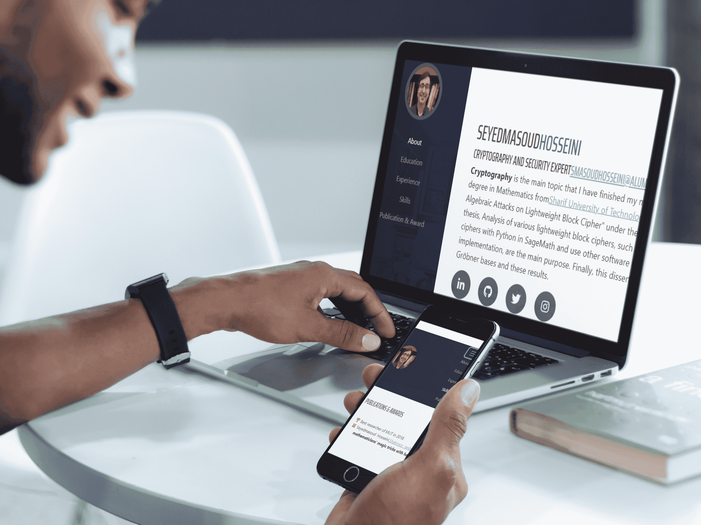

<h1 align="center">simple personal website with Next.js framework</h1>


<p align="center">This is a simple personal website with Next.js framework, React library and Bootstrap</p>
<p align="center"></p>

## demo of this personal page:
[smasoudhosseini.ir](http://smasoudhosseini.ir/)


## :gear: Configuration

### Running
	run the following commands for download the repository and install:
	
### `git clone git@github.com:smasoudhosseini/Next.js-simple-personal-website.git`
### `cd Next.js-simple-personal-website`
### `npm install` 
### `npm run dev`


```bash
# Clone this repository
$ git clone git@github.com:smasoudhosseini/Next.js-simple-personal-website.git

# Go into the repository folder
$ cd Next.js-simple-personal-website

# Install and Running
$ npm install
$ npm run dev

```

Open [http://localhost:3000](http://localhost:3000) to view it in your browser.

The page will reload when you make changes.\
You may also see any lint errors in the console.

### Builds the app for production
	Builds the app for production to the `out` folder.`

```bash
# Make .next folder
$ npm run build

# Make out folder for production
$ npm run export

```

## Acknowledgements :
-Template based on [Start Bootstrap - Resume](https://github.com/startbootstrap/startbootstrap-resume)